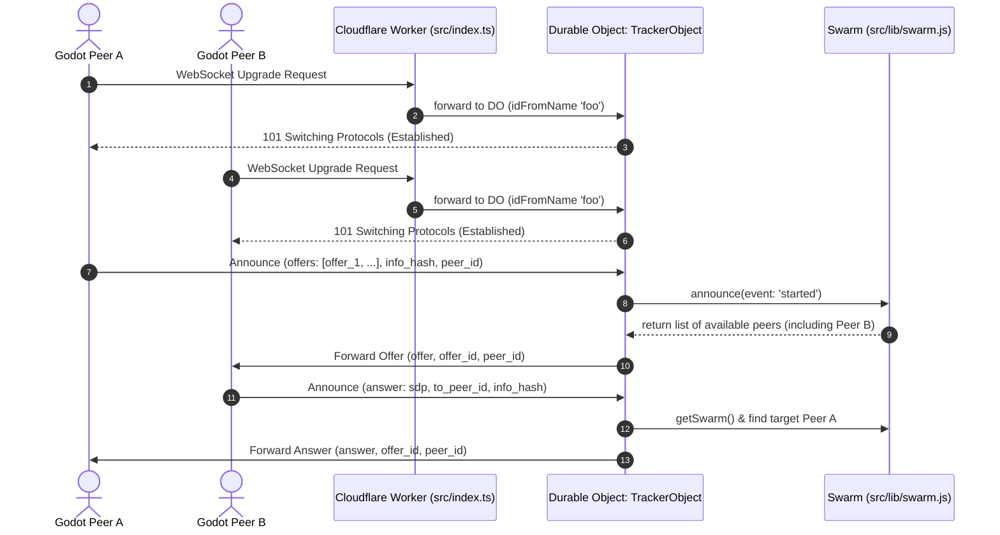

# Code Review and Architecture Analysis: `ws-tracker-server`

This document provides a detailed overview of the system architecture, file structure, component breakdown, and code review observations for the `ws-tracker-server` codebase.

---

## 1. System Architecture & Data Flow

The server is a lightweight **WebRTC Signaling Server** built on top of Cloudflare Workers and Durable Objects. It adapts the WebSocket tracking protocol from the `bittorrent-tracker` specification to act as a session coordinator/announcer for Godot client connections via Tube.

The following sequence diagram illustrates the lifecycle of client registration and the WebRTC handshake orchestrated by the Durable Object.



---

## 2. Directory and File Map

```
ws-tracker-server/
├── wrangler.jsonc            # Cloudflare Workers configuration (Durable Objects binding)
├── package.json              # Project dependencies (lru, uint8-util, string2compact)
├── src/
│   ├── index.ts              # Entrypoint. Exports Worker and TrackerObject Durable Object
│   ├── types/
│   │   └── index.d.ts        # Ambient type overrides for string2compact / bittorrent-tracker
│   └── lib/
│       ├── tracker.ts        # [Empty] Reserved for future tracker logic
│       ├── swarm.js          # In-memory BitTorrent-style swarm session logic (with LRU eviction)
│       ├── parse-websocket.js# Handlers to parse, validate, and convert binary fields from socket inputs
│       └── common-node.js    # Shared utility functions and constants (regexes, action mappings)
```

---

## 3. Detailed Component Breakdown

### 3.1. Main Entrypoint & Durable Object Handler
#### [`src/index.ts`](file:///Users/andrewdavis/dev/ws-tracker-server/src/index.ts)
- **Worker Fetch Handler**:
  - Intercepts incoming requests and verifies the `Upgrade: websocket` header.
  - Resolves a single global Durable Object instance using `env.WEBSOCKET_SERVER.idFromName('foo')`.
  - Forwards the request directly to the `TrackerObject` stub.
- **TrackerObject (Durable Object)**:
  - Extends `DurableObject` and manages client WebSocket connections.
  - Implements the [webtorrent-tracker server spec](https://github.com/webtorrent/bittorrent-tracker/blob/master/server.js).
  - Uses `acceptWebSocket(server)` and handles the following states:
    - **`webSocketMessage`**: Parses incoming packets, registers the peer in the appropriate `Swarm`, retrieves a list of targets, and routes WebRTC SDP `offers` and `answers` directly between client sockets.
    - **`webSocketClose` / `webSocketError`**: Cleans up peer references from any active swarms to prevent memory leaks and dangling sockets.
  - Keeps a local `torrents` map mapping `infoHash` to `Swarm` instances.

### 3.2. Swarm Registry
#### [`src/lib/swarm.js`](file:///Users/andrewdavis/dev/ws-tracker-server/src/lib/swarm.js)
- Manages the peers associated with a specific `infoHash` (e.g., matching a particular game session or lobby).
- Uses an **LRU Cache** (`lru` library) to store peer records. This prevents memory leaks if a client goes offline abruptly without sending a disconnect event.
- Coordinates states: `started`, `stopped`, `completed`, `update`, `paused`.
- Picks peers randomly using `random-iterate` to ensure balanced matching when a peer asks for connection targets.

### 3.3. WebSocket Parser
#### [`src/lib/parse-websocket.js`](file:///Users/andrewdavis/dev/ws-tracker-server/src/lib/parse-websocket.js)
- Parses the raw WebSocket string payload to JSON.
- Standardizes binary fields (such as `info_hash`, `peer_id`, and `to_peer_id`) by converting them from 20-character strings into hex representation using `bin2hex` (from `uint8-util`).
- Validates the length and payload formatting.
- Populates connection IP and port details extracted from request headers.

### 3.4. Shared Constants
#### [`src/lib/common-node.js`](file:///Users/andrewdavis/dev/ws-tracker-server/src/lib/common-node.js)
- Declares the core constants representing tracker state.
- Exposes regexes for IPv4 and IPv6 formatting (`IPV4_RE`, `IPV6_RE`).
- Implements custom `querystringParse` and `querystringStringify` methods that handle escaping for non-UTF8 querystrings (important for standard BitTorrent clients).

---

## 4. Key Code Review Findings & Observations

### 🔍 1. In-Memory Persistence & State Loss
- **Finding**: Durable Object state (`this.torrents`) is stored entirely in memory.
- **Implication**: If the Durable Object is recycled by Cloudflare (due to cold starts, platform updates, or restarts), all active swarms are lost. Although `wrangler.jsonc` has SQLite database bindings configured (`new_sqlite_classes: ["TrackerObject"]`), the code makes no use of `this.ctx.storage` or SQLite queries.
- **Mitigation**: For dynamic matchmaking or signaling, transient state is often acceptable since clients will reconnect. However, if session persistence becomes a requirement, the SQLite bindings should be utilized to persist session data.

### 🔍 2. Scalability Bottleneck with Single Global Name (`'foo'`)
- **Finding**: The Worker fetches a single Durable Object using:
  ```typescript
  let id = env.WEBSOCKET_SERVER.idFromName('foo');
  ```
- **Implication**: All client connections globally will route to the exact same Durable Object instance. While this makes it easy for any client to find any other client, a single DO instance is bounded by memory limits and single-threaded execution context (CPU).
- **Recommendation**: If the traffic scales, segment the namespace by lobby ID, game category, or region (e.g., using a query parameter such as `?lobby=name` to dynamically resolve the Durable Object: `idFromName(lobbyId)`).

### 🔍 3. Empty File `tracker.ts`
- **Finding**: [`src/lib/tracker.ts`](file:///Users/andrewdavis/dev/ws-tracker-server/src/lib/tracker.ts) has 0 bytes.
- **Recommendation**: This file can either be removed or used to host TypeScript interfaces and types shared across the project.

### 🔍 4. Lack of Authentication Check
- **Finding**: The README notes that connections should be filtered and rejected if they lack the `SECRET_KEY`. Currently, no such check exists in `fetch` or `webSocketMessage`.
- **Recommendation**: Add a check in `fetch` inside `src/index.ts` to inspect request headers or URL parameters (e.g. `?secret=...`) and reject with `401 Unauthorized` if it is missing or doesn't match `env.SECRET_KEY`.

---

## 5. Potential Improvements Checklist

- [ ] Implement `SECRET_KEY` validation check inside the HTTP fetch handler before upgrading.
- [ ] Migrate JavaScript files (`swarm.js`, `parse-websocket.js`, `common-node.js`) to TypeScript for unified type checking.
- [ ] Clean up the empty `tracker.ts` file if not needed.
- [ ] Implement dynamic DO naming based on query parameters (e.g., partition by room/session) instead of the hardcoded `'foo'`.
- [ ] Implement a TURN credential generator route to assist clients behind symmetric NATs (referencing the TODO in README).
